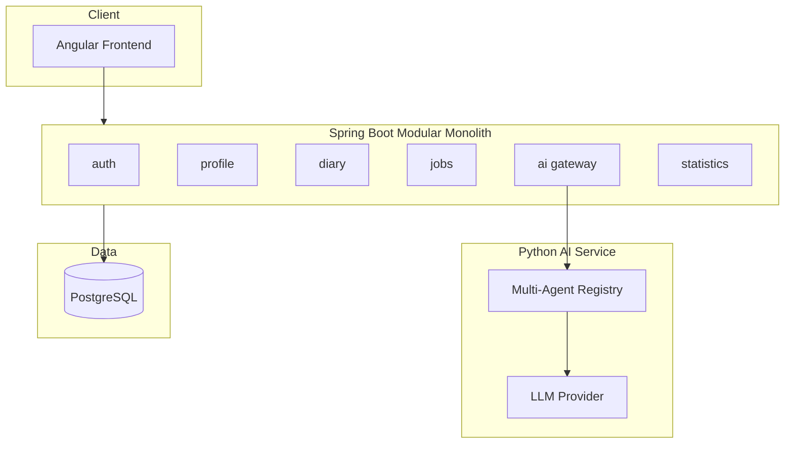

# Arquitetura — CareerOS Platform

## Decisão: Monólito Modular

O MVP utiliza **Modular Monolith** em vez de microsserviços prematuros. Cada módulo possui boundaries claros (domain, application, infrastructure, api) e pode ser extraído futuramente.

## Diagrama de Alto Nível



## Módulos e Responsabilidades

| Módulo | Responsabilidade |
|--------|------------------|
| `auth` | OAuth2, JWT, RBAC, auditoria |
| `profile` | Perfil Mestre — fonte única da verdade |
| `diary` | Diário de Carreira + busca histórica |
| `achievements` | Banco de Conquistas (auto-alimentado) |
| `jobs` | Rastreador de vagas + conectores plugáveis |
| `resume` | Gerador de currículos por vaga |
| `linkedin` | Sugestões SEO (sem publicação automática) |
| `recruiter` | CRM de recrutadores + follow-ups |
| `ai` | Gateway HTTP para python-service |
| `statistics` | Dashboard executivo + métricas |
| `skills` | Mapa de competências |
| `notification` | Lembretes e alertas |

## Agentes de IA

Todos compartilham contexto via Perfil Mestre + memória persistente (futuro: embeddings).

```
profile → resume → linkedin → jobs → ats
                ↓
              diary → achievements
                ↓
            interview → mentor
```

## Conectores de Vagas

Interface `JobConnector` permite adicionar plataformas:

- LinkedIn (quando API permitir)
- Gupy
- Indeed
- Revelo
- GeekHunter

## Segurança

- OAuth2 Resource Server (JWT)
- Multi-tenant via `userId` em todas as entidades
- Criptografia de dados sensíveis (roadmap)
- Logs estruturados + OpenTelemetry (roadmap)

## Observabilidade

- Spring Actuator + Prometheus
- Grafana (profile `observability`)

```bash
docker compose --profile observability up -d
```

## Escalabilidade Futura

1. Extrair `python-service` (já separado)
2. Extrair `jobs` + conectores
3. Adicionar Kafka para eventos de domínio
4. Multi-tenant com isolamento por schema
